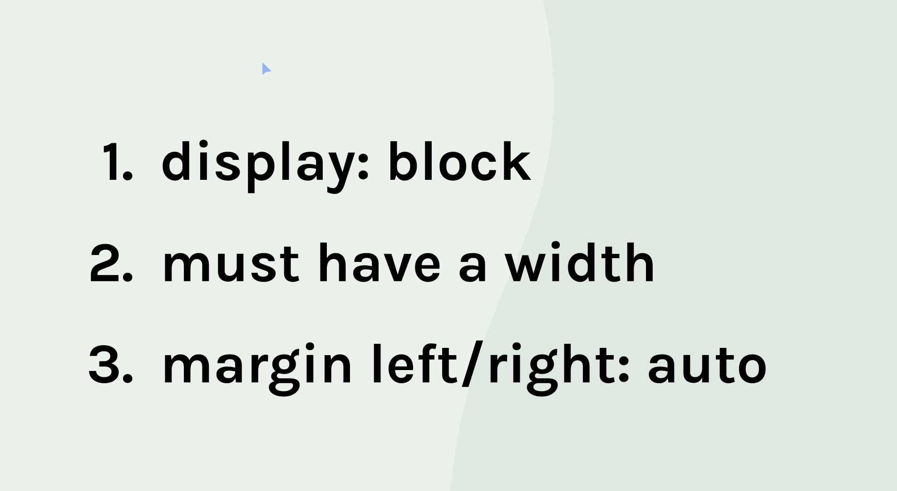

# Concepts I've learned in this project

- CSS Syntax: selectors, properties and values
- Inline and block elements
- The Box model: margin, padding, border and content (width and height)
- `Div` elements and the `class` atribute to style child elements
- Centering techniques:
  - using `margin-left:auto` and `margin-right:auto` for block elements,
    
  - using `text-align:center` for inline elements and,
  - using Flexbox for multiple direct child elements (adding `display:flex` and `justify-content:center` to parent element)
